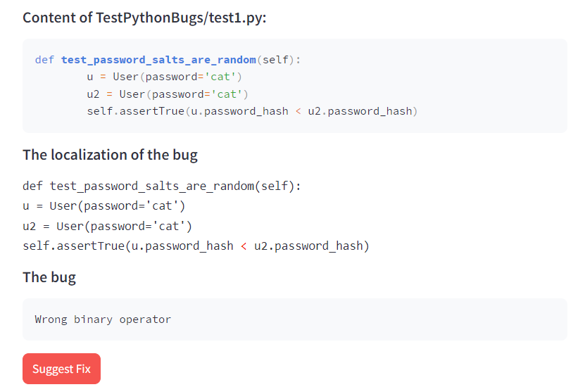

# 🧠 AI-Powered Debugging

This project explores the use of deep learning to automatically detect, localize, and fix logical and runtime bugs in source code. It was developed as part of my engineering graduation internship at **Novobit Group GmbH, Germany**.

## 📌 Project Overview

Traditional debugging tools often require manual inspection of code and are limited in detecting subtle logical errors. This project proposes an intelligent solution using AI models trained on buggy and corrected code samples to automate the process.

### 🔍 Objectives

- Detect whether a given code snippet contains a bug
- Localize the exact position of the bug within the code
- Automatically suggest a corrected version of the buggy code

## 🛠️ Technologies & Tools

- Python
- PyTorch
- Transformers (Hugging Face)
- CodeT5 (fine-tuned for bug detection and repair)
- Graph Neural Networks (for early experiments)
- Scikit-learn (for baseline ML models)
- Tree-sitter (code parsing)

## 🔬 Model Architecture

The final solution is based on **CodeT5**, a transformer-based model pre-trained on programming languages. The model was fine-tuned for two tasks:

1. **Bug Classification** – Determine if a code snippet is buggy
2. **Bug Fixing** – Generate corrected code from buggy input

Earlier approaches included:
- Binary classification using RandomForest and SVM
- Graph-based learning with GNNs to capture code structure

## 📊 Dataset

The dataset was collected from open-source repositories and research datasets. It contains:
- Python and Java snippets
- Corresponding buggy and fixed versions
- Annotated examples for training classification and sequence-to-sequence tasks

## 📈 Results

- The fine-tuned CodeT5 model outperformed classical ML approaches and GNNs.
- Achieved high accuracy in both bug detection and repair on the test set.
- Successfully identified issues like:
  - Incorrect variable usage
  - Reversed operands
  - Misused binary operators

## ## 🖼️ Screenshots

Here are some screenshots from the application:

### 🔍 Example 1 – Project Upload
.png)

### 🛠️ Example 2 – Bug Detection & Localization

